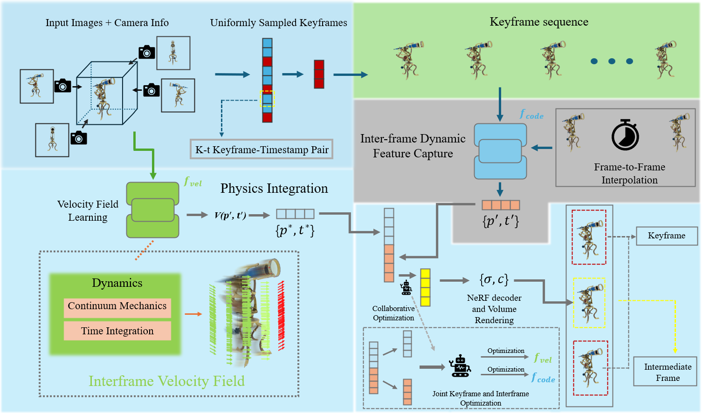

# Dyn3D: Dynamic 3D Scene Reconstruction from Video based on Unified Learning


We present a novel framework to simultaneously learn the geometry, appearance, and physical velocity of 3D scenes only from video frames, such that multiple desirable applications can be supported, including future frame extrapolation, unsupervised 3D semantic scene decompositio, and dynamic motion transfer.

# Environment Setup
```
    # create conda environment
    conda create --name Dyn3D python=3.9
    
    # activate env
    conda activate Dyn3D
    conda install pytorch==1.12.1 torchvision==0.13.1 torchaudio==0.12.1  cudatoolkit=11.6 -c pytorch -c conda-forge
    pip install functorch==0.2.1
    
    # pip install 
    pip install -r requirements.txt

```
# Datasets
Both Dynamic Object and Dynamic Indoor Scene datasets could be downloaded from [google drive](https://drive.google.com/drive/folders/1je-JW64UvRJ2hmA6nzEKA7VGRIn4lAi6?usp=sharing). 

Please change the "logdir" and "basedir" in config based on the locations of downloaded datasets.

# Training
We provide several config files under [config](./config/) folder for different datasets.

For reconstruction, you can run
```
python train_nvfi.py --config ./config/InDoorObj/bat.yaml --static_dynamic 
```

If you want to train the segmentation fields, simply run the following commend
```
python train_segm.py --config config/InDoorObj/bat.yaml --checkpoint -1
```

# Evaluation
For generating intermediate frames, you can do so by running
```
python train_nvfi.py --config ./config/InDoorObj/bat.yaml --checkpoint -1 --not_train --eval_test
```


